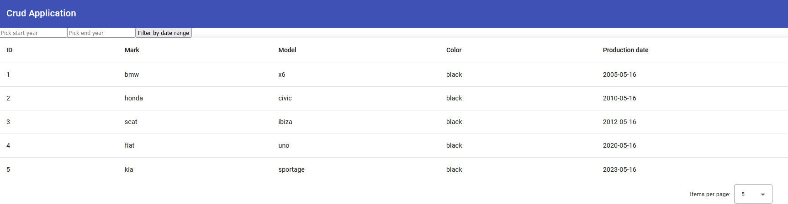
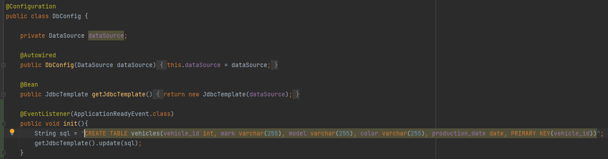
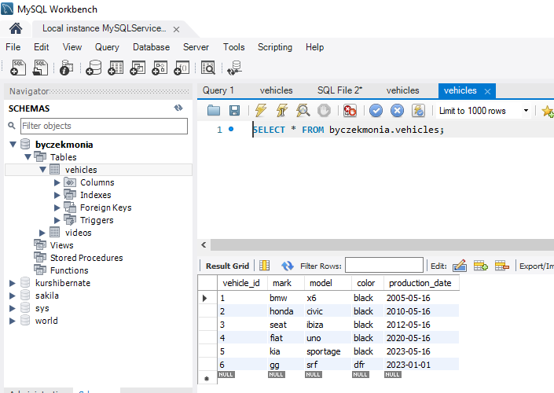
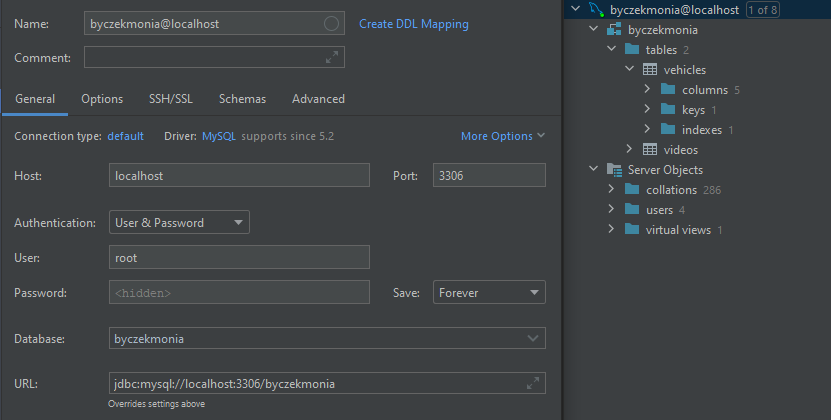
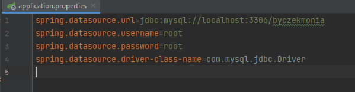

# ksb2-7
Napisz aplikacje, która z poziomu GUI pozwala na dodawanie i wyświetlanie pojazdów znajdujących się w bazie danych. 
Pojazd ma mieć pola, które umożliwią przechowanie marki, modelu, koloru oraz daty produkcji. Stwórz formularz z poziomu, którego będzie możliwe na wyświetlanie pojazdów z konkretnego przedziału dat. Np. wyświetlenie wszystkich pojazdów w bazie, których data produkcji jest w zakresie 2010 – 2015.

—————————

Link do frontendu: https://github.com/monikaRegula/ksb2-mvc-domowe-angular/tree/jdbc_1_domowe

—————————

Schemat bazy danych stworzyłam tak:

—————————

Dane wyeksportowałam w Mysql Workbench:

—————————

Połączenie z bazą danych skonfirugowałam tak:

